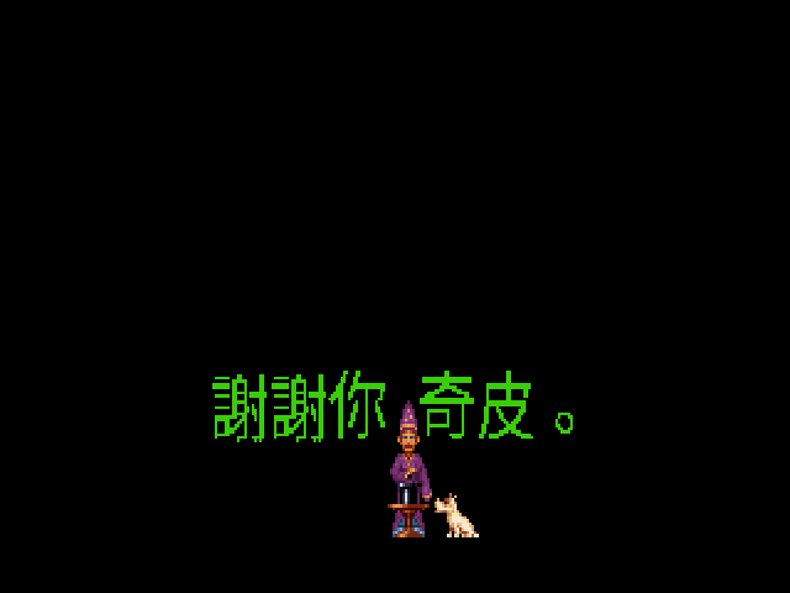
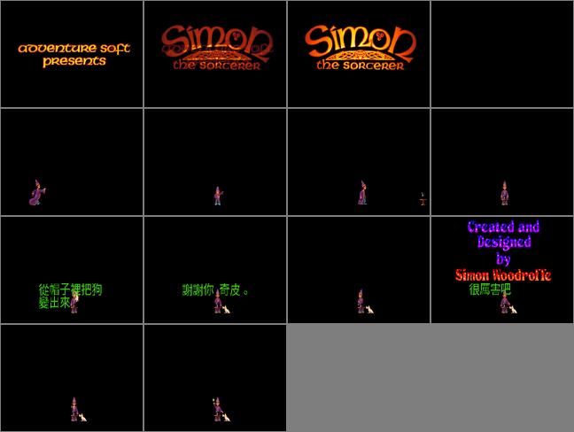
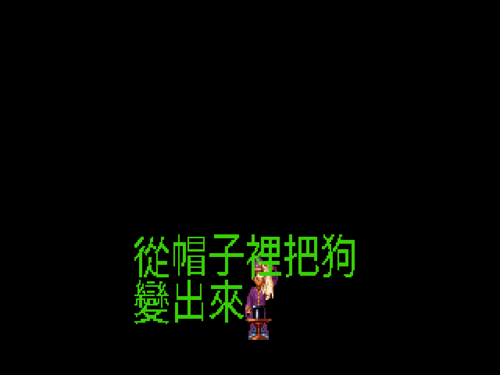

# 魔法師西蒙 — 繁體中文化(CD 語音 × Floppy 完整字幕）



> 一個 12 歲男孩、一隻叫奇皮的狗、一本《古老魔法書》,和一個到處都是魔戒惡搞與英式冷笑話的平行世界。
> 三十年前它沒有中文版;現在,它有了——而且連英語配音都一起留著。

---

## 一封給老玩家的信

還記得嗎?1993 年,《Simon the Sorcerer》(魔法師西蒙)從英國 Adventure Soft 的工作室裡誕生。
那是點擊冒險遊戲的黃金年代——LucasArts 和 Sierra 打得火熱,而這個滿嘴刻薄話、活像少年版《黑爵士》的小巫師,
用它 320×200 的手繪場景和一句接一句的冷笑話,擠進了很多人的 5.25 吋磁片盒。

當年我們是怎麼玩的?一手滑鼠,一手翻著《電腦玩家》或《軟體世界》上零星的圖文攻略,
遇到「trip-trapping over my bridge」的巨魔、跟你大談「歧視」的蠹蟲、崇拜托爾金崇拜到中暑的咕嚕——
看得懂的笑一半,看不懂的猜一半。它的靈魂全在對白裡,而對白,是英文的。

這個專案,就是把那半場沒聽懂的笑話補完。

---

## 這一版做了什麼

<a name="features"></a>

先講最反直覺的一件事:**英文 CD 語音版,其實沒有完整字幕。**

當年 Adventure Soft 把 1993 floppy 版(純文字)加上語音做成 CD talkie 版時,為了塞進 170MB 的配音,
把大量對白的文字**從資料裡拿掉了**。ScummVM 的原始碼註解講得很白:

> `// English and German versions don't have full subtitles`

所以你若直接在 CD 版打開字幕,會看到**角色嘴巴在動、卻一個字都沒有**——不是 bug,是資料先天就缺了約四成。

這一版的解法是「融合」:

- **字幕**用 **1993 floppy 版的完整文字**當來源(每句都在),
- **語音**用 **CD talkie 版的英語配音**,
- 兩者用引擎腳本的行序對齊接起來。

於是你得到一個原版從來不存在的組合:**完整中文字幕 + 完整英語配音,還能一鍵切回英文對照。**

| 特色 | 說明 |
|---|---|
| **完整中文字幕** | 全劇 **4035 條**對白/物件/系統文字全數繁中,補足 CD 版缺的約四成 |
| **英語語音** | CD talkie 配音照舊播放(Chris Barrie 為 Simon 獻聲的原版聲線) |
| **中／英字幕切換** | 遊戲中按 **F8** 即時切換字幕語言,語音維持英語 |
| **正常字級 CJK** | 24×24 點陣中文,不縮成一團(retro CJK 慣例:拉大字、不塞小位) |
| **操作選單繁中** | 動詞列(走到/查看/使用⋯)中文化 |
| **防拷 bypass** | 開場的「唸咒防拷」自動填答,免翻手冊 |
| **不動遊戲原檔** | 全部透過 patch ScummVM 引擎達成 |



*(片頭魔術秀,中文字幕即時渲染;右下角 "Simon the Sorcerer" 標題是遊戲的 VGA 美術圖,屬另議範圍。)*

---

## 那些你當年沒看懂的笑話,現在補上了

魔法師西蒙的價值,九成在對白。這一版把整場戲都翻了,舉幾段當年最經典的:

**巨魔橋**——一隻按劇本演出的巨魔,和一隻不想再被頂進河裡的比利山羊,吵起了勞資糾紛:

> 「在我得到滿足之前,任何人都不得通過這座橋。」
> 「你走運了,我正好是個到處推銷滿足的業務員。」

**會說話的蠹蟲**——你一句「抱歉,在我來的地方蠹蟲不會說話」,換來一整套控訴:

> 「這就是歧視——第三級的!你們這些該死的人類都一個樣。」

**巫師小子入門包**——花三十枚金幣入會當巫師,拿到的是⋯

> 「一枝巫師小子羽毛筆、巫師小子卷軸信紙⋯全裝在這個免費的巫師小子錢包裡。」

英式冷笑話的節奏、故意的無厘頭、對《魔戒》《睡美人》《傑克與魔豆》的惡搞,都盡量照原味譯出。



*(長句自動按全形字寬換行。)*

---

## 快速開始

需要:合法持有的《Simon the Sorcerer》**floppy 版**(提供完整文字+畫面)與 **CD 版的 `SIMON.VOC`**(提供語音)。

```bash
# 遊戲目錄需含: floppy 遊戲檔 + CD 的 SIMON.VOC + 三個 CHT 資產
#   simon_zh24.dcjk  simon_zh.tab  simon_voice.map
# 然後任一方式啟動:

# A) AppImage(已打包好的繁中 ScummVM)
./dist/SimonTheSorcerer-CHT-x86_64.AppImage -p /你的遊戲目錄 --auto-detect

# B) 本機腳本
bash scripts/play.sh
```

遊戲中 **F8** 切換中/英文字幕。

---

## 從原始碼重建(全 docker,不污染主機)

```bash
bash scripts/build_font.sh                                   # 烘 24×24 Big5 點陣字型
python3 tools/build_translation.py translations/zh.tsv fonts/simon_zh.tab   # 編譯譯表
bash scripts/build_scummvm.sh                               # 編譯 patched ScummVM(只啟 agos)
bash scripts/build_appimage.sh                              # 打包 AppImage
```

floppy 完整資料若只有安裝磁片(壓縮的 `GAME.RED`),用 `scripts/floppy_install_dosbox.sh`
在容器內以 DOSBox 自動跑原版安裝程式解出。

---

## 技術深潛

<a name="tech"></a>

這不是一般 ScummVM 中文化。SCUMM 引擎內建 CJK 基礎設施,補幾十行就能接;
AGOS 引擎**零 CJK 基礎**,且螢幕文字散在 6 個地方、分兩套渲染,還得先解決「英文版字幕缺四成」的資料問題。

核心架構(詳見 [`docs/FUSION_DESIGN.md`](docs/FUSION_DESIGN.md)):

- **以 floppy 為底**:字幕文字原生完整,零缺口。
- **注入以「行的身分」為 key**(floppy stringId),而非比對英文字串——這樣「有語音、無文字」的行也掛得上字幕。前一版用英文比對,天生救不了那些行。
- **對齊用引擎自己的反組譯器**:dump floppy 與 CD 兩版腳本,在文字 opcode 按位置配對 `speechId ↔ floppy 文字`(1655 子程式 1:1 對齊)。
- **語音注入**:floppy 版本無 talkie,patch 使其載入 CD `SIMON.VOC`,於對白 opcode 依對映播放對應語音。
- **CJK 24×24 渲染**:加大 AGOS 字幕文字緩衝(6400→40000 bytes)以容納全形字;視窗文字(動詞列/物件名)走獨立的 surface 繪字路徑。
- **硬編碼 UI**:動詞列(`verb.cpp`)、存讀檔訊息(`saveload.cpp`)在原始碼加 `ZH_TWN` 分支;防拷用引擎內建的 `_copyProtection=false` 自動填答路徑。

engine patch 新增 `engines/agos/cht_fusion.{h,cpp}`,並改動 `agos.cpp`、`string.cpp`、`charset.cpp`、`charset-fontdata.cpp`、`verb.cpp`、`saveload.cpp`、`event.cpp`、`res.cpp`。基準:ScummVM v2.9.1。

---

## 文件索引

| 文件 | 內容 |
|------|------|
| [PLAN.md](PLAN.md) | 完整中文化範圍、渲染策略、分階段計畫 |
| [strings/scope.md](strings/scope.md) | 權威翻譯範圍:6 類文字來源與驗收基準 |
| [docs/FUSION_DESIGN.md](docs/FUSION_DESIGN.md) | 融合架構:CD 語音 + floppy 字幕 + 中英切換 + 對齊實測 |
| [docs/LOCALIZATION_DIFFICULTY.md](docs/LOCALIZATION_DIFFICULTY.md) | 中文化難度討論:為何 AGOS 比一般 ScummVM 難 |
| [docs/COMPARISON.md](docs/COMPARISON.md) | 與前一版(deepseek+glm 產出)的逐項差異 |
| [docs/PREVIOUS_REPO_POSTMORTEM.md](docs/PREVIOUS_REPO_POSTMORTEM.md) | **前一版失敗分析**:六個症狀、一個根因、教訓對照 |
| [docs/PROMO_VIDEO_PLAN.md](docs/PROMO_VIDEO_PLAN.md) | **宣傳影片拍攝計畫**:三段 pipeline、分鏡、配樂(原版)、CPU-safe 骨架 |
| [docs/ANNOUNCEMENT.md](docs/ANNOUNCEMENT.md) | **介紹文案 / 貢獻說明**(含托爾金笑話,可直接發布) |
| [WORKLIST.md](WORKLIST.md) | 工作清單與進度 |

---

## 專案結構

```
simon-1-cht-claude/
├── translations/zh.tsv          # 繁中譯表(floppy id → 中文,4035 條)
├── fonts/                       # simon_zh24.dcjk / simon_zh.tab / simon_voice.map
├── build/scummvm-src/           # patched ScummVM(engines/agos/cht_fusion.*)
├── dist/                        # SimonTheSorcerer-CHT-x86_64.AppImage
├── tools/                       # 抽取 / 對齊 / 字型 / 譯表工具
├── scripts/                     # docker build / DOSBox 安裝 / dump / 截圖 / 打包
├── strings/ docs/               # 範圍、對齊資料、設計與難度文件
└── screenshots/                 # 驗證截圖
```

---

## 致謝

- **Adventure Soft** — 創造了這款經典。
- **Chris Barrie**(《紅矮星號》Rimmer)— 為 Simon 獻聲。
- **ScummVM 團隊** — 跨平台引擎與 AGOS 支援。

## 版權

- 遊戲《Simon the Sorcerer》版權屬 Adventure Soft 所有。
- ScummVM 以 GNU GPLv3 授權;本專案的 patch、工具與翻譯以 GNU GPLv3 發布。
- 本專案**不含**原始遊戲檔案,使用者需自行合法持有 floppy 與 CD 版。
